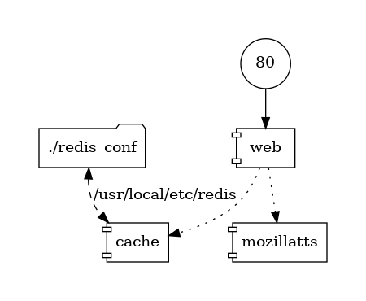

# Webpage-to-Speech

Given a URL, this service return an audio file / stream (in WAV format) that reads out the main content of the webpage.


## Deployment

### To run locally

1. Ensure that you have `conda` ready. If not, may I suggest [Mambaforge][mf]?
1. Run [`synesthesiam/docker-mozillatts`][mz]: `docker run -it -p 5002:5002 synesthesiam/mozillatts`.
2. Create a conda env: `conda env create -n tts -f conda-requirements.txt -y`.
3. Activate the env: `conda activate tts`.
5. Start the server. There are different ways to do it:
   - Using the **dev** server from [Flask][fl]: `FLASK_APP=main.py FLASK_ENV=development flask run`.
     - Note: Although Flask does have a production mode, it is still [not recommended][nr] for production use. For that, we use...
   - Using the **prod** server from [Gunicorn][gu]: `gunicorn main:app --bind 0.0.0.0:80 --timeout 3600`.
     - As seen in the `--timeout` option, a request allowed to run for 1h only. Very large text, therefore, may fail.


[mf]: https://github.com/conda-forge/miniforge#mambaforge
[mz]: https://github.com/synesthesiam/docker-mozillatts
[fl]: https://flask.palletsprojects.com/en/1.1.x/
[nr]: https://flask.palletsprojects.com/en/1.1.x/deploying/
[gu]: https://gunicorn.org/

### To run with Docker

Simply do:

```shell
docker-compose up --build
```

Something to note:

- The Dockerfile in this repo is for the URL-to-audio web server only. It still requires the [`synesthesiam/docker-mozillatts`][mz] image to be running in a container. Therefore, although you can manually set up the 2 containers, the Docker Compose way is always going to be easier.
- It uses Gunicorn instead of the vanilla Flask server.

The containers work together like this:



Sidenote: The diagram above is generated with this command:

```shell
docker run --rm -it --name dcv -v $(pwd):/input pmsipilot/docker-compose-viz render -m image docker-compose.yml
```

## Usage

To hear the playback, 
- If you are on macOS, ensure that `sox` is installed: `brew install sox`. This provides the playback command `play`. 
- If you are on Linux, `aplay` should do.

Now, you can convert a webpage (using `https://sjmulder.nl/en/` as an example) into audio using:

```shell
curl -G --output - \
    --data-urlencode 'url=https://sjmulder.nl/en/' \
    'http://localhost:80/' | \
    play -
```

Of course, you can always save the returned audio as a file and work from there.

## To-dos

Here's a list of future features and tasks:

- [ ] Investigate why `aiohttp` calls to the [`synesthesiam/docker-mozillatts`][mz] would fail (See the Notebook).
- [ ] Make `.lrc` lyrics or subtitles to go with the audio file.
- [ ] Make the speech read out different formats with different audio clues. For example:
  - bolded text can be read with emphasis or notification sounds, 
  - read out the numbering of list items, no matter whether the list is ordered or unordered, 
  - different levels of headings should be announced ("## lorem ipsum" should sound like "Section 1: lorem ipsum."), and 
  - images should be announced with their `alt` titles. If that's unavailable, call a image labeling service to generate a caption on-the-fly.

## License

GPL v3. See `LICENSE`.